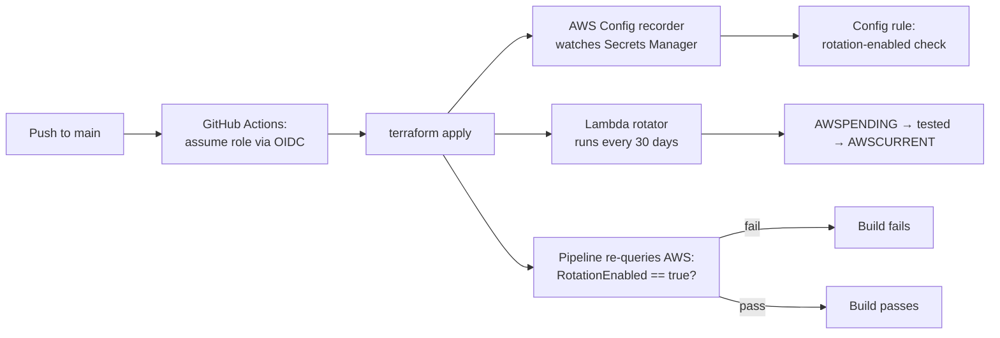

# AWS Governance & Compliance Automation

Continuous drift detection on secret rotation, a correctly-implemented Secrets Manager
rotation Lambda, and a CI/CD pipeline that never touches a static AWS credential — and
verifies its own outcome against real AWS state before it passes.

## The problem this solves

Three failure modes show up constantly in AWS environments that "did the audit once":

- **Rotation drift.** Secrets Manager rotation gets enabled at deploy time and nobody
  checks again. It silently turns off, or was never actually enabled correctly, and the
  gap isn't caught until an audit or an incident.
- **Rotation Lambdas that half-implement the contract.** AWS's rotation lifecycle has
  four required steps (`createSecret` → `setSecret` → `testSecret` → `finishSecret`).
  Skip the idempotency check in `createSecret` or the validation in `testSecret` and
  rotation fails silently, or worse, promotes a broken secret to `AWSCURRENT`.
- **Long-lived credentials in CI/CD.** A pipeline that deploys infrastructure using a
  static `AWS_ACCESS_KEY_ID`/`AWS_SECRET_ACCESS_KEY` pair stored in GitHub Secrets is
  one leaked log line away from full account compromise.

This project addresses all three at once, as code, not as a manual checklist.

## Architecture



- **AWS Config**, scoped deliberately narrow — `recording_group.resource_types` covers
  only `AWS::SecretsManager::Secret`, not "all supported" — feeding a managed rule
  (`SECRETSMANAGER_ROTATION_ENABLED_CHECK`) that continuously flags any secret where
  rotation isn't on. This runs independent of whether a deploy pipeline ever executes —
  drift gets caught even if nobody touches the pipeline for months.
- **The rotation Lambda implements all four steps AWS actually requires**, not a
  stub: `createSecret` checks for an existing `AWSPENDING` version before generating a
  new 32-character password (idempotent — safe to retry), `testSecret` validates the
  pending secret before anything gets promoted, `finishSecret` performs the actual
  `AWSCURRENT`/`AWSPENDING` stage swap. Scheduled via
  `aws_secretsmanager_secret_rotation` to run automatically every 30 days.
- **GitHub Actions authenticates via OIDC**, not a stored key pair. The IAM role's trust
  policy scopes `sub` to this exact repository (`repo:KDavisCodeCloud/freelance-hub`,
  main-branch pushes and pull requests only) — no `AWS_ACCESS_KEY_ID` or
  `AWS_SECRET_ACCESS_KEY` exists anywhere in this repo or its GitHub Secrets.
- **The pipeline verifies reality, not just its own exit code.** The last CI step
  doesn't trust that `terraform apply` succeeding means rotation is actually on — it
  re-queries AWS directly (`aws secretsmanager describe-secret ... RotationEnabled`)
  and fails the build if the live state doesn't match intent.
- **Remote state**: S3 backend with a DynamoDB lock table, encrypted — not a local
  `.tfstate` file sitting on someone's laptop.

## What this enables

- Rotation-enabled is a continuously monitored fact, not a deploy-day assumption that
  quietly goes stale.
- Zero standing AWS credentials anywhere a leaked CI log or compromised laptop could
  expose them.
- A pipeline that fails loudly when deployed state doesn't match compliance intent,
  instead of a green checkmark that means "Terraform didn't error."
- Config, IAM, and the rotation Lambda are all defined as code — an auditor can trace
  policy → implementation → live verification through one pipeline run, not a slide deck.

## Philosophy

Compliance that isn't continuously monitored isn't real compliance — it's a fact that
was true once, at deploy time. A rotation Lambda that doesn't correctly implement every
step of AWS's rotation contract is worse than no rotation at all: it fails silently and
manufactures false confidence. Long-lived credentials in a pipeline are a standing
liability no matter how carefully they're guarded — OIDC federation removes the
liability instead of managing it. And a pipeline that verifies its own outcome against
live AWS state, not just its own exit code, is the actual difference between "it
deployed" and "it's compliant."

## Honest scope note

This is a single-account deployment, not yet a parameterized multi-client baseline.
The AWS account ID and IAM role ARN are hardcoded in `github-oidc.tf` and the GitHub
Actions workflow, and `backend.tf`'s state bucket/table are specific to this account.
Deploying this into a different AWS account means updating those three places —
there's no parameter-file swap for onboarding a new environment yet.

## How to use

Prerequisites: an AWS account, Terraform >= 1.7, an S3 bucket + DynamoDB table for
remote state, and a GitHub OIDC identity provider trust relationship configured for
your AWS account.

```bash
git clone https://github.com/KDavisCodeCloud/freelance-hub.git
cd freelance-hub/01-governance-aws/terraform

# Update backend.tf's bucket/table, github-oidc.tf's sub condition, and the
# workflow's role-to-assume ARN to match your AWS account first.

terraform init
terraform plan
# Push to main to deploy via the OIDC-authenticated pipeline in
# .github/workflows/project1-governance-aws.yml
```
